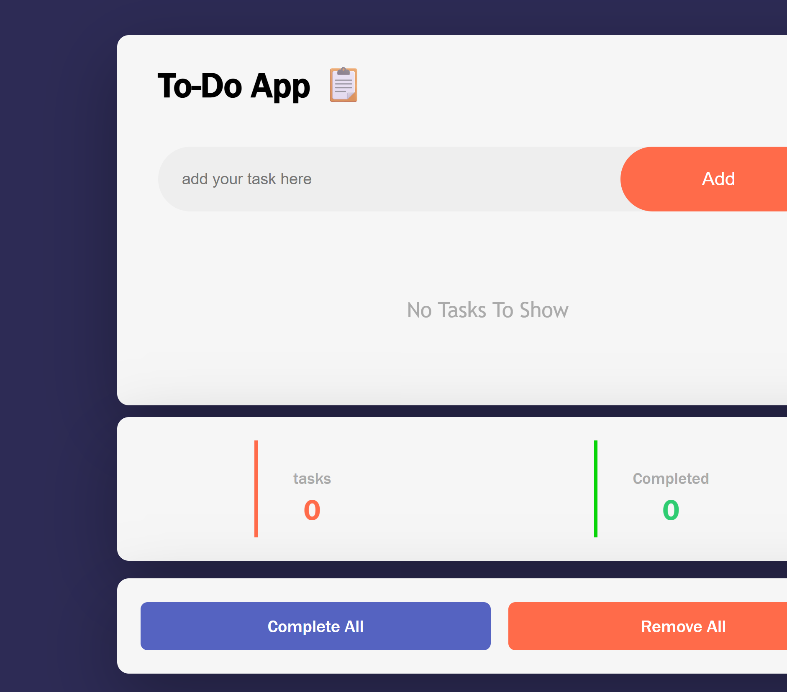

# To-Do App 📋

A clean and responsive To-Do application built with vanilla JavaScript.

## 🔗 Live Demo
[View Live](https://youssef-mosa.github.io/To-Do-App)

## ✨ Features
- Add and remove tasks
- Mark tasks as completed
- Complete all / Remove all tasks
- Tasks counter

## 🛠️ Built With
HTML5 | CSS3 | JavaScript

## 📸 Screenshot

## 🚀 Getting Started
git clone https://github.com/youssef-mosa/To-Do-App
open index.html
